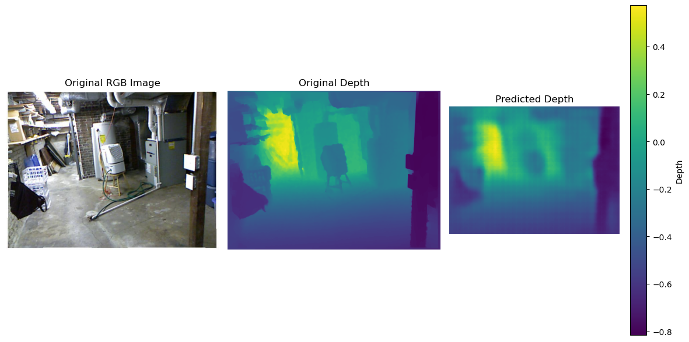
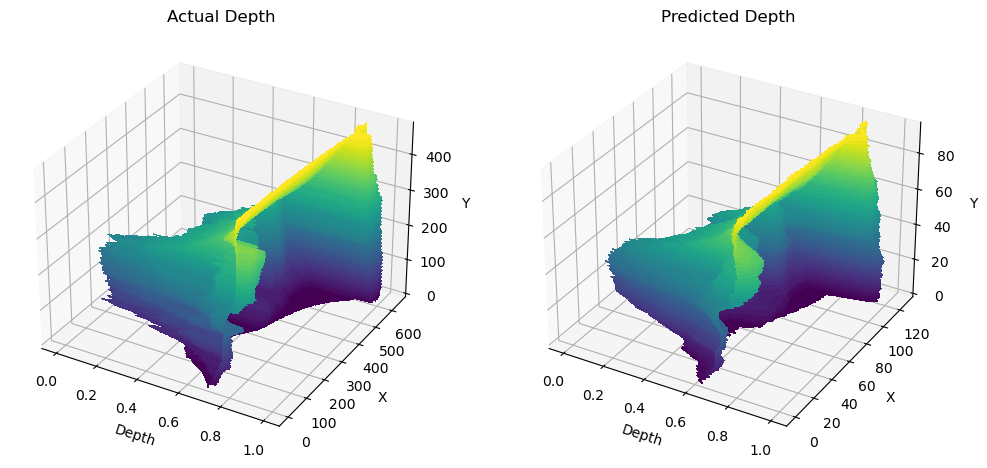
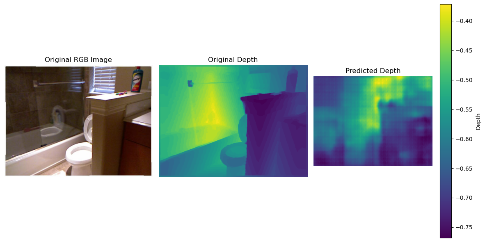
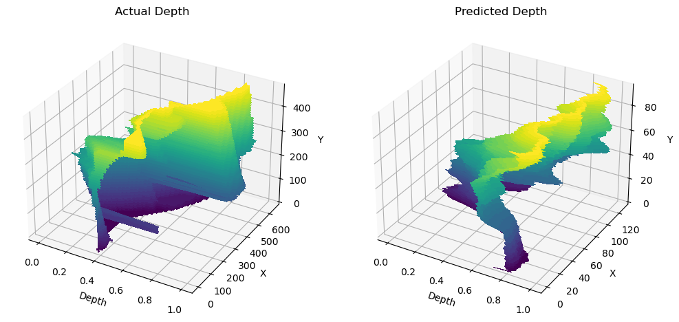

# Depth Estimation Using U-Net

Implementation of the encoder-decoder architecture for estimating depth on the NYU 2v dataset.

The dataset I used can be found here:
[link](https://www.kaggle.com/datasets/soumikrakshit/nyu-depth-v2)
## Loss functions used
Using three different loss functions when training because MAE (Mean absolute loss) isn't sufficient for predicting the depth of images as smaller disreprencies in depth can 
lead to behavior that doesn't make sense.

Generally doing the same thing as [here](https://arxiv.org/html/2404.07686v1) except not pretraining autoencoder on ImageNet for feature extraction (so task will be more computational heavy)

Three types of losses:
1. MAE loss - Compute the mean absolute error between prediction and actual pixel by pixel
2. Gradient edge loss - Compute the error in the edge transitions from pixel to pixel (Captures pixel to pixel changes in both the vertical and horizontal directions). The purpose of doing so is to ensure correct transitions among edges (to ensure that edges are placed in the correct position in reconstruction).
3. Structural similarity loss - Compute the error in the difference in luminance and structural similarity between two images. Contrast similarity is also sometimes included
    1. Luminance - luminance is the mean value of the image (the mean value of all the pixels) - When you scale luminance on an image, you're shifting the mean pixel value of all images
    2. Contrast -  constrast is the standard deviation in the image (How homogenous / heterogenous) the picture taken is. - When you scale contrast on an image, you're shifting how far off from the mean pixel intensity each image is
    3. Structural information - structural information between two images is encoded as how far off the mean each pixel is at each individual position. This is esentially a comparison of the covariance between two images. If a pixel at a given location in the predicted image is far from the mean, let's say higher than the mean, and a pixel at the same location in the actual image is also higher than the mean, then we'll see high structural similarity. Unlike luminance and contrast however, structural similarity is directional! This means that if a given pixel in the predicted output is above the mean and a given pixel in the original image is below the mean, then we're going to see low structural similarity. This means outputs are not between 0 to 1, but -1 to 1 where -1 is higher structural similarity and 1 is lower structural similarity.
    When computing structural similarity, we multiply the similarity of all these quantities together to receive a value between -1 and 1 where -1 indicates high dissimilarity and 1 indicates high similarity. This can be rescaled by subtracting this quantity from 1 and then scaling by some quality so that the loss is between 0 and x where a larger x is a larger loss.
    Intuitively, it should make sense that **structural information is more important than luminance and contrast** because it is the only variable that controls directionality of the loss.

## Model Implemented

I intend to use a UNet with flash attention with 10M~ parameters.

Flash attention is not yet implemented because of memory issues with current model. Images are resized to 128 by 96 for the same reason. I intend to use gradient accumulation to free up memory. 

## Results
These are results obtained training only on around 5% of the original dataset (the dataset is too large for my computer to process).

Pictures are the original image, the actual depth, and the predicted depth

The first image is on data that the model was explicitly trained on - What I mean is that since the NYU data is split into folders based on videos of rooms, the training and test data are very similar and reconstructions of depth are good.

This is the accompanying graph visualization of depth

And the following is on unseen data i.e. videos from rooms that the model has never seen in training. Note that these rooms look very different with different colored floors and towels.

And this is the accompanying graph visualization

